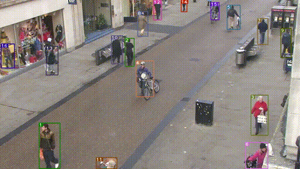

# Yolov5 + Deep Sort with PyTorch


  

## Introduction

This repository contains a two-stage-tracker. The detections generated by YOLOv5 (https://github.com/ultralytics/yolov5) are passed to a Deep Sort algorithm (https://github.com/ZQPei/deep_sort_pytorch) which tracks the objects. It can track any object that your Yolov5 model was trained to detect.


## Tutorials

* [Yolov5 training on Custom Data (link to external repository)](https://github.com/ultralytics/yolov5/wiki/Train-Custom-Data)&nbsp;
* [Deep Sort deep descriptor training (link to external repository)](https://github.com/ZQPei/deep_sort_pytorch#training-the-re-id-model)&nbsp;
* [Yolov5 deep_sort pytorch evaluation](https://github.com/mikel-brostrom/Yolov5_DeepSort_Pytorch/wiki/Evaluation)&nbsp;


## Before you run the tracker

1. Make sure that you fulfill all the requirements: Python 3.8 or later with all [requirements.txt](https://github.com/mikel-brostrom/Yolov5_DeepSort_Pytorch/blob/master/requirements.txt) dependencies installed, including torch>=1.7. To install, run:

`pip install -r requirements.txt`

2. Clone the repository recursively:

`git clone --recurse-submodules https://github.com/mikel-brostrom/Yolov5_DeepSort_Pytorch.git`

If you already cloned and forgot to use `--recurse-submodules` you can run `git submodule update --init`

3. Github [block pushes of files larger than 100 MB](https://help.github.com/en/github/managing-large-files/conditions-for-large-files). Hence you need to download two different weights: the ones for yolo and the ones for deep sort

- [download the yolov5 weight from the latest realease, under assets](https://github.com/ultralytics/yolov5/releases). Place the downlaoded `.pt` file under `yolov5/weights/`
- [download the deep sort weights](https://drive.google.com/drive/folders/1xhG0kRH1EX5B9_Iz8gQJb7UNnn_riXi6). Place ckpt.t7 file under`deep_sort/deep/checkpoint/`


## Tracking sources

Tracking can be run on most video formats

```bash
python3 track.py --source ...
```

- Video:  `--source file.mp4`
- Webcam:  `--source 0`
- RTSP stream:  `--source rtsp://170.93.143.139/rtplive/470011e600ef003a004ee33696235daa`
- HTTP stream:  `--source http://wmccpinetop.axiscam.net/mjpg/video.mjpg`


## Filter tracked classes

By default the tracker tracks class 0, this is, persons. In this case I recommend you to get [these weights](https://drive.google.com/file/d/1gglIwqxaH2iTvy6lZlXuAcMpd_U0GCUb/view?usp=sharing) for increased performance

```python
parser.add_argument('--classes', nargs='+', default=[0], type=int, help='filter by class') # tracks persons only
```

If you want to track all 80 MS COCO classes just delete the default value

```python
parser.add_argument('--classes', nargs='+', type=int, help='filter by class') # tracks all MS COCO classes
```

If you want to select only a few classes to track add their associated integer to default

```python
parser.add_argument('--classes', nargs='+', default=[16, 17], type=int, help='filter by class') # tracks cats and dogs, only
```

[Here](https://tech.amikelive.com/node-718/what-object-categories-labels-are-in-coco-dataset/) is a list of all the possible objects that a Yolov5 model trained on MS COCO can detect. Notice that the indexing for the classes in this repo starts at zero.

## MOT compliant results

Can be saved to `inference/output` by 

```bash
python3 track.py --source ... --save-txt
```

## Other information

For more detailed information about the algorithms and their corresponding lisences used in this project access their official github implementations.

