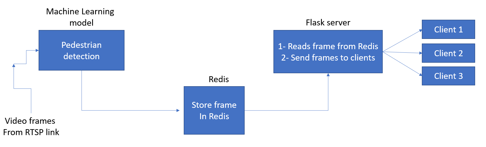
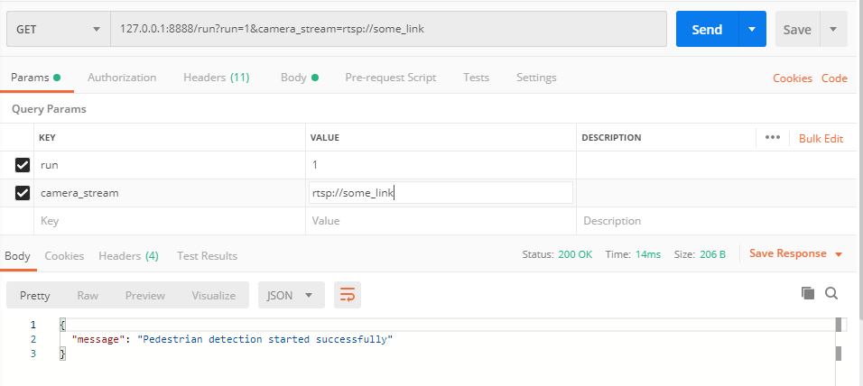

# Stream pedestrian detection web server

### Requirements

- python = 3.7
- redis
- flask
- opencv
- pytorch
- dotenv

Please note that you need to install redis on your system.

### The architecture.

1 - `RealTimeTracking` reads frames from rtsp link using threads 
(Using threads make the web server robust against network packet loss) 

2 - In `RealTimeTracking.run` function in each iteration frame is stored in redis cache on server.

3 - Now we can serve the frames on redis to clients.

4 - To start the pedestrian detection, after running 
`rtsp_webserver.py`, send a GET request on `127.0.0.1:8888/run`
with setting these GET method parameters

| Param | Value | Description |
| :-------------: | :-------------: | :-------------: |
| run  | 1/0  |  to start the tracking set 1/ to stop tracking service set it as 0|
| camera_stream  | 'rtsp://ip:port/admin...'  | provide it with valid rtsp link |

for example:

    (to start the service)  127.0.0.1:8888/run?run=1
    (to stop the service)  127.0.0.1:8888/run?run=0
    (to change the camera) 
        1- 127.0.0.1:8888/run?run=0 (first stop the current service)
        2- 127.0.0.1:8888/run?run=0&camera_stream=rtsp://ip:port/admin... (then start it with another rtsp link)
    

5 - get pedestrian detection stream in `127.0.0.1:8888`
